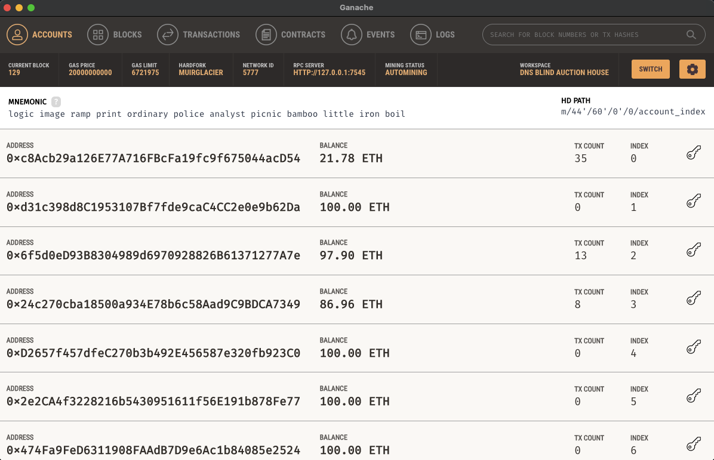
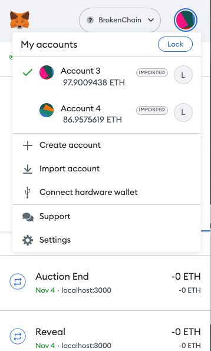
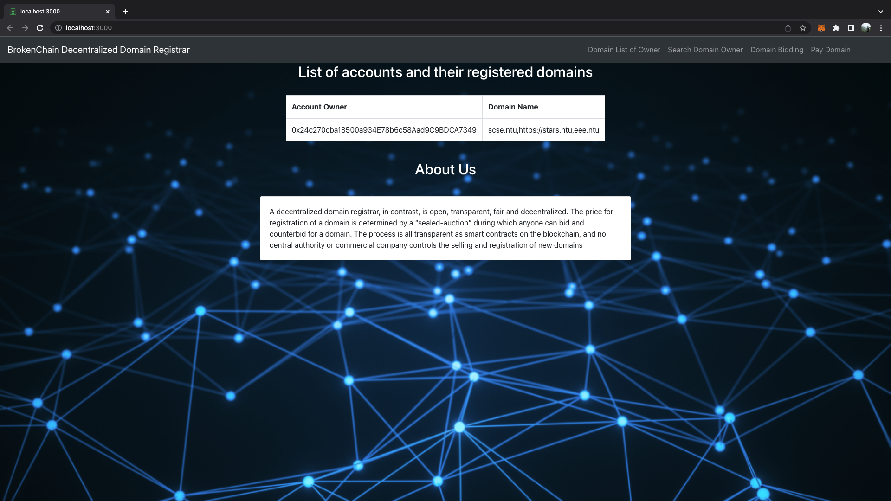
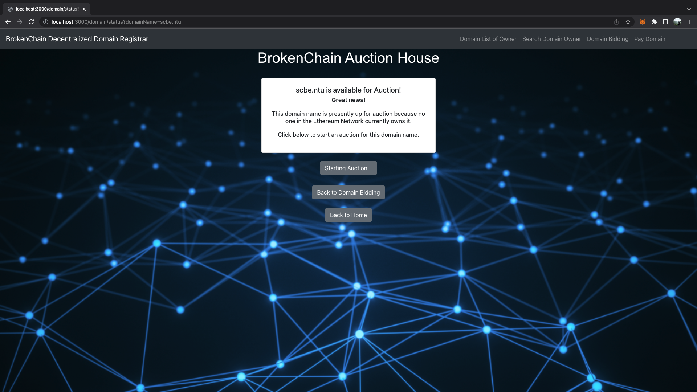

# CZ4153 Blockchain Technology: DNS Blind Auction House

Welcome to the DNS Blind Auction House's repository.

**Khush Kothari**, **Akshat Sharma**, and **Aditya Chandrasekhar** worked together on this project, which implements a decentralized domain registrar that enables users of the Ethereum Blockchain Network to bid for unregistered domain names of their choice.

The **DNS Blind Auction House**, a Decentralized Domain Registrar, supports features like listing of registered domains, querying the actual Ethereum public address (owner) behind the domain, bidding for an unregistered domain, and many more. Users can bid for domain names using the "commit-and-reveal" blind auction bidding process to interact with the blockchain.

## Contents

- [Setting Up Environment](#Environment)
  - [0. Setting Up Pre-Requisites](#PreReqs)
  - [1. Setting up Project Directory](#Directory)
  - [2. Setting Up using the Ganache Environment](#GanacheEnv)
- [Setting Up the React Front End Web Application](#FrontEnd)
- [Navigating around the DNS Blind Auction House Web Application](#Navigation)
  - [1. The Auction House](#AuctionHouse)
  - [2. List of Registered Domains](#ListRegisteredDomains)
  - [3. Look-Up the Owner of a Domain](#OwnerOfDomain)
  - [4. Look-Up the Domain(s) of an Owner](#DomainsOfOwner)
  - [5. Send ETH to a Domain](#SendETH)
- [Testing of Contracts](#Testing)
  - [1. DNS Contract](#DNSContract)
  - [2. Blind Auction Contract](#BlindAuction)

<a name="Environment"></a>

## Setting Up Environment

<a name="PreReqs"></a>

### 0. Setting up Pre-Requisites

Do ensure that the following are installed first:

- NodeJS - can be installed [from this link](https://nodejs.org/en/).
- npm - can be installed [from this link](https://www.npmjs.com/get-npm).
- Metamask Google Chrome Extension - can be installed [from this link](https://metamask.io/download.html).
- Ganache - can be installed [from this link](https://www.trufflesuite.com/ganache).

Next, we will install Truffle with the following commands:

```bash
npm install truffle -g
truffle version # To check if Truffle has been installed successfully
```

<a name="Directory"></a>

### 1. Setting up Project Directory

To use the DNS Blind Auction House, you will first need to clone the repository to your local computer. You may do so in your own desired local directory with the following command

```bash
git clone git@github.com:khushk21/Blockchain-Project.git
```

We will be utilising the `Migrations.sol`, `Dns.sol` and `BlindAuction.sol` Solidity files for our smart contracts.

We can compile the contracts with the following command:

```bash
truffle compile
```

We should now see a new folder named `build/contracts`, which contains the files `BlindAuction.json`, `Dns.json`, and `Migrations.json`.

<a name="GanacheEnv"></a>

### 2. Setting Up using the Ganache Environment

<a name="GanacheToProject"></a>

#### 2.1 Linking of Ganache Workplace with Project

Start your Ganache application by double clicking the downloaded app image during installation.

Click on "New Workspace (Ethereum)", which will create a running instance of the Ethereum blockchain locally -- together with 10 accounts created, each with a balance of 100 ETH.

Next, we need to link the **DNS Blind Auction House** project with your local Ganache blockchain, by specifying a customized workspace name and the path to the file `truffle-config.js`.



Once inputted successfully, click on "Add Project" to link and save the project in Ganache.

Now, we can deploy our contracts. We do so with the following command:

```bash
truffle migrate --network local --reset
```

During the migration, take note of the contract address obtained after deploying the Dns Solidity contract.

Navigate into the `./webapp/src/controller/configurations.js` file. Make the following 2 changes:

1. Change the address in the constant `DnsContractAddressGanache` to the value displayed after contract address field.
2. Change the `ENVIRONMENT` constant to `'Ganache'`.

<a name="GanacheToMetamask"></a>

#### 2.2 Linking of Metamask to the Ganache Environment

To properly run the environment with Ganache and make payments to the Auction House smart contracts, we will need to link your Metamask account with the Ganache localhost.

Head to [this link](https://medium.com/@kacharlabhargav21/using-ganache-with-remix-and-metamask-446fe5748ccf) to properly link your Metamask to Ganache.

Once done, your Metamask account and the project are both now successfully connected to Ganache. You may now proceed directly to the section [Setting Up the React Front End Web Application](#FrontEnd).

<a name="FrontEnd"></a>

## Setting Up the React Front End Web Application

Navigate into the `/webapp` folder.

Execute the following commands to initialise the React Web Application.

```bash
npm install
```

Once that is done, we can run the web application on `localhost:1234` using the following command:

```bash
npm start
```

While at the site, we now need to connect our MetaMask extension to our localhost site.



Once done, we are finally ready to navigate around the Front End Website!

<a name="Navigation"></a>

## Navigating around the DNS Blind Auction House Web Application

After entering `localhost:1234`, we will see the web application page.




The web application has **5 different sections**:

<a name="AuctionHouse"></a>

### 1. The Auction House

Users enter through The Auction House to see if a domain name has already been registered. These three situations are:

- A domain name has already been registered but hasn't yet expired. Users won't be able to place bids until the current owner of this domain name expires.
- There are no active auctions and the domain's ownership has previously expired or is not currently held by anyone. Here, the user has the option to launch a new auction, which will activate our [DNS Smart Contract](#DNSContract"startAuction()" )'s method.
- Although a domain is now up for auction, it is not currently owned by anyone. In this case, the current auction will be in one of three stages:
- The **Bidding Phase**, during which customers can place blind auction bids. The [Bidding Phase](#BiddingPhase) section has further details.
- The **Reveal Phase** is where users identify themselves and demonstrate that their bids during the "Bidding Phase" were indeed their own. The [Reveal Phase](#RevealPhase) section has more details.
- **End Phase:** When users decide to conclude an ongoing auction, the domain is awarded to the successful bidder, and the losing bidders are given their money back. The [End Phase] section (#EndPhase) contains more details.

<a name="ListRegisteredDomains"></a>

### 2. List of Registered Domains

A list of Ethereum Public addresses and their registered domain name URLs may be found at the bottom of the page. Through a series of function calls, the following domain names were acquired from the [DNS Smart Contract](#DNSContract):

- "getAddress()": To obtain a comprehensive list of all Ethereum public addresses that at the time of writing currently own domain name URLs.
- "getURLCount(ethAddress)": Retrieves the total number of URLs a specific Ethereum public address owns.
- "getURL(ethAddress, I Retrieves the URL for the ith domain name that belongs to a specific Ethereum public address.

All of these function calls result in the conversion of Ethereum Public addresses into domain name URLs, which are then both stored and rendered from the web page's "data" state.

<a name="OwnerOfDomain"></a>

### 3. Look-Up the Owner of a Domain

Here, we call the `getRegisteredURL(domainURL)` function from our [DNS Smart Contract](#DNSContract), which returns the Ethereum public address of the owner of a given domain name URL.

<a name="DomainsOfOwner"></a>

### 4. Look-Up the Domain(s) of an Owner

Here, since the `data` state of the web page already holds a mapping of Ethereum Public addresses to domain name URLs as mentioned above, we simply just obtain the appropriate URLs owned by a given Ethereum Public Address, by accessing the `data` state mapping.

<a name="SendETH"></a>

### 5. Send ETH to a Domain

This section allows us to send ETH to the Ethereum Public Address mapped to the domain name URL given as input. This will open up Metamask, which facilitates the ETH transaction to this public address.

<a name="Testing"></a>

## Testing of Contracts

To set up the testing with Ganache, we have to ensure that we have all the npm packages for the test by running the following command:

```bash
npm install
```

We can then run use truffle to run all the test by running the following command:

```bash
truffle test
```

We should see **31 test cases successfully passing**, with tests raging from unit testing of the various functionality of each contract, to integration testing of various scenarios ran on both contracts integrated together. All these tests mock a sample real case usage of the 2 contracts participating in an auction and registering a domain.

<a name="DNSContract"></a>

### 1. DNS Contract

#### 1.1 State Variables

- **dns_lookup_table** : Resolving URL -> Ethereum Address
- **reverse_lookup_table** : Map of Ethereum Address -> All URLs associated
- **expiry_date** : URL Expiry Date
- **auctions** : Map of URL -> Auction Address
- **expiry** : Time for URL to expire
- **bidding_length** : Time for bidding in deployed auction
- **reveal_length** : Time for reveal in deployed auction
- **grace_period** : Time to claim URL by ending auction

#### 1.2 Functions

- **startAuction** : deploys Blind Auction contract to start a blind auction
- **registerAddress** : Handles URL registration after an auction is ended and the auction contract calls this function to update the state of this contract (Only the auction associated with the URL may call this)
- **getAddress** : View function for Frontend to query address list
- **getURLCount** : View function for Frontend to query number of domains owned by an address
- **getURL** : View function for Frontend to query the domain that a user owns
- **getRegisteredURL** : View function for Frontend to query the owner of a particular domain
- **checkExpired** : View function for Frontend to query if a domain is expired
- **getExpired** : View function for Frontend to query expiry date
- **checkAuctionEnded** : View function for front end to query if auction has been ended
- **checkAuctionPastGrace** : View function to check if auction is past the grace period
- **getAuctionURL** : View function for Frontend to get auction contract address

#### 1.3 Reasoning

At the price of state variable updates when new URLs are added, storing the forwards and backwards resolution of (address -> URLs) and (URL -> address) provides rapid and easy lookup. This is a deliberate trade-off because search requests ought to vastly exceed registrations.

After necessary, auctions are deployed, and when they are finished, the auction calls the appropriate callbacks to register the winner as the URL owner. The accounts/contracts calling the register URL function are checked to see if they match the internal records of the auction address linked to that URL.

To ensure openness in the bidding process, many auction-related state variables, such as the bidding and reveal time, are made public. The necessity for computation (looping through an array to see whether something already exists) can be reduced by using a few helper state variables, such as the address not unique mapping, which increases storage space somewhat but reduces run time.

Last but not least, a grace period is included to make sure that users cannot refuse a URL registration by starting an auction but not finishing it.

<a name="BlindAuction"></a>

### 2. Blind Auction Contract

#### 2.1 State Variables

- **Bidding end time**
- **Reveal end time**
- **State of Auction**
- **Highest Bidder**
- **Highest Bid**
- **Map of Ethereum Address -> all bids made by user**
- **Map of Ethereum Address -> all deposits and pending returns**

#### 2.2 Functions

- **bid** : Allows user to register a bid and deposit ether for their bids
- **reveal** : Allows user to reveal their bids
- **auctionEnd** : Register user as owner of domain after end of auction and winner determined and also refund all loser's ether

#### 2.3 Reasoning

<a name="BiddingPhase"></a>

##### 2.3.1 Bidding Phase

The **Bidding Phase** allows users to bid multiple bids so that they can hide the amount of Ether being sent to the contract, as this value is publicly available to everyone due to the properties of a decentralised blockchain network. Thus, instead of taking the publicly available value as the bid value of the bidder, we convert the publicly available ETH value to be the bidder's input deposit instead, and collect his actual intended bid value separately. As the bid values (not to be confused with the deposit values) are hashed before sending, the bids are hidden from everyone else and can only be verified in the reveal phase when the user sends the same input to generate the hash from the keccak256 hash.

Hence, during the bidding phase, all bids are hidden and the only information that is available to the public is the ether deposit amount sent by the user. Users can send multiple fake bids to deposit extra ether into their account to fake the true value of their bids, and to top up the total deposits in their account. To indicate and send fake bids, users will input a "false" value as their Real Boolean, and this value will also be hashed. Here, users just have to make sure that the total sum of all deposit inputs has to be greater than or equal to the individual (true) bid values of each bid.

For example, a user might want to bid a bid value of 1 ETH for their domain name in the Auction House.

The user can choose to make 2 separate bids to mask their bid.

- **First Bid**:
  - **Deposit** = 0.1 ETH, **Bid Value** = 1 ETH, **Real Boolean** = True (indicating that this bid is real), **Secret** = secretvalue
- **Second Bid**:
  - **Deposit** = 10 ETH, **Bid Value** = 20 ETH, **Real Boolean** = False (indicating that this bid is false, and is only used to mislead other auction viewers, and also used to deposit more eth into their bidding account), **Secret** = secretvalue2

Here, the bidder's bid will successfully go through, as their total deposit of **0.1 + 10 = 10.1 ETH** is larger than their actual (true) bid of **1 ETH**. This means that the bidder would have bidded **1 ETH**, though the publicly available ETH values are **0.1 ETH** and **10 ETH** respectively in each bid transaction.

_Note that the Bid Value, Real Boolean, and Secret Values will all be hashed and sent as data to the Blind Auction Smart Contract._

<a name="RevealPhase"></a>

##### 2.3.2 Reveal Phase

The user can disclose every offer they made during the bidding phase during the **Reveal Phase**. To ensure that users cannot selectively divulge particular bids, they must reveal every single bid they made, **including** the fraudulent ones. Additionally, users can only reveal their bids once. Their bids will be void if any revelations are made later or are incorrect. This prevents users from selectively disclosing their bids, which may lead to an unfair auction that isn't truly blind because the user would only reveal their lowest price, selectively disclosing the higher bids when they realized they were losing the auction. Thus, by only enabling the user to divulge **once**, this security problem is avoided.

Using the aforementioned user in the Bidding Phase above as an example of what to input during the Reveal Phase:

- **Bid Values**: 1, 20
- **Real Booleans**: True, False
- **Secret Values**: secretvalue, secretvalue2

_Note that values MUST be inputted in the order that they were bidded in (ie. the bid value order should be 1, 20 instead of 20, 1)_

<a name="EndPhase"></a>

##### 2.3.3 End Phase

The user would end the auction during the **End Phase**. The domain name will be registered to the winning bidder's Ethereum public address after the auction is over, and ownership will be transferred to them. Users who placed a bid but did not place it will receive a refund of their bid, provided they completed the Reveal Phase successfully.

_Note that we retrieve our timings to bound our functions based on the now() function in solidity, which takes the current block timestamp as our "now" time. This is how we determine when the auction Bidding Phase should end and transition to the Reveal Phase, and likewise for the Reveal Phase to transition to the End Phase._
